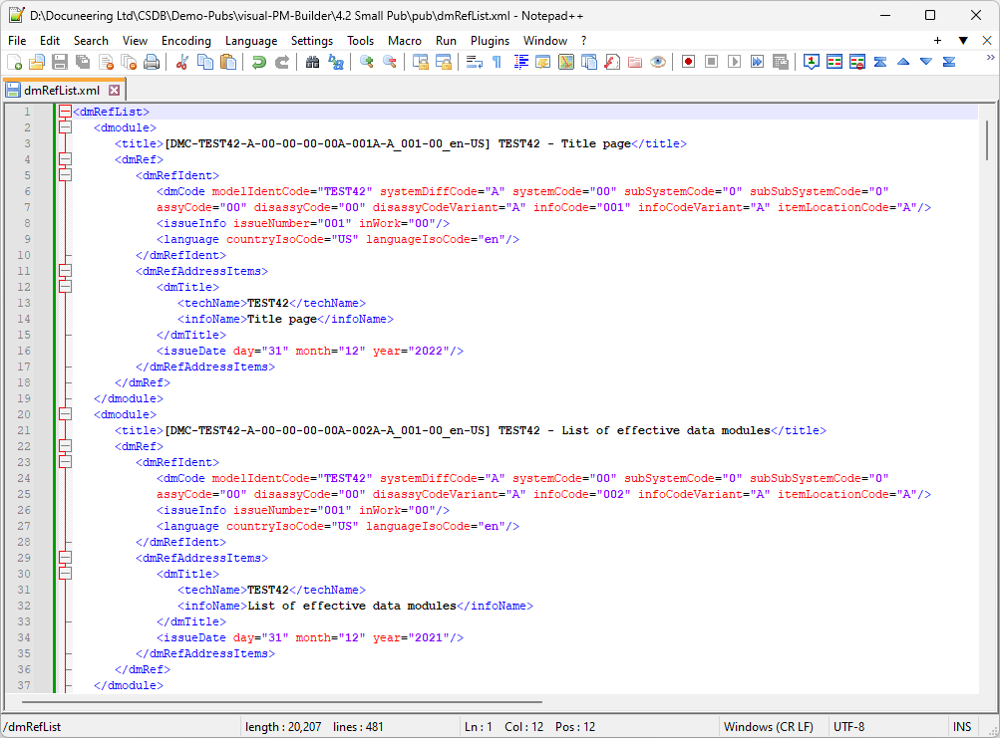
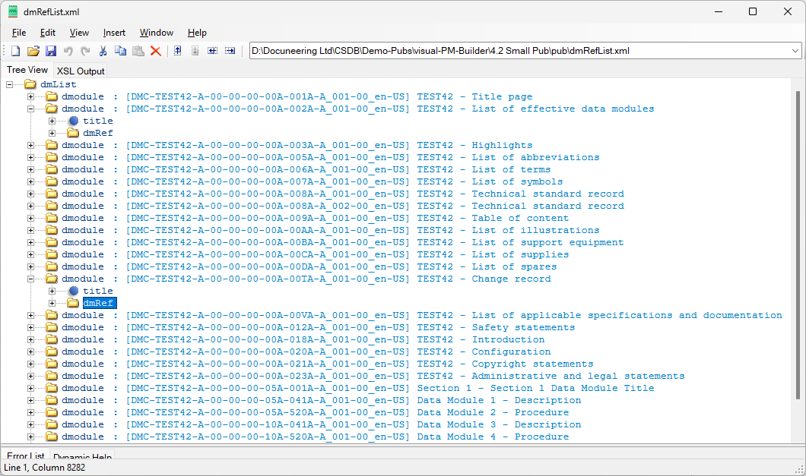

# S1000D-dmRef-List

The `dmRefList.vbs` script file will read through a folder and where it finds an S1000D Data Module file, it will construct the required <dmRef> structure and save it into a new XML file called `dmRefList.xml`.

 

The resultant `dmRefList.xml` file, when opened in XML Notepad, allows you to drag-and-drop the required <dmRef> structure into your S1000D Publication Module file.

 
